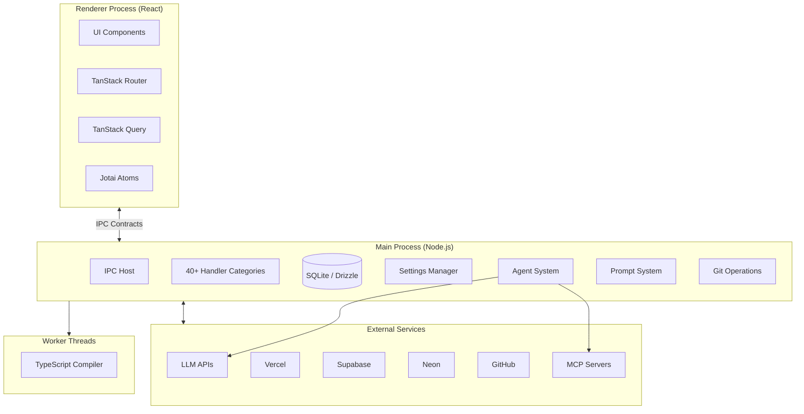
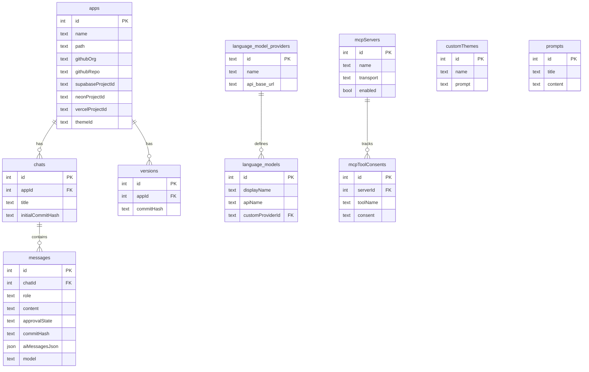
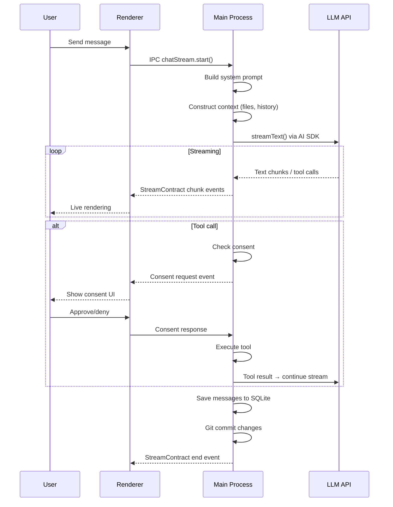

# Architecture

Dyad is a local, open-source AI app builder — like Lovable, v0, or Bolt, but running on your machine. It's an Electron desktop application that lets users create, modify, and deploy web applications through AI-powered code generation with a live preview.

## Key Capabilities

- **AI-powered code generation** with streaming responses, tool calls, and live preview
- **Multi-provider LLM support** — OpenAI, Anthropic, Google, Azure, xAI, Bedrock, Ollama, LM Studio, OpenRouter
- **Agent system** with 22+ tools for file operations, code analysis, database queries, web search, and planning
- **Template-based app creation** — React/Vite (default), Next.js, and portal templates
- **Git integration** — branches, commits, diffs, merge conflict resolution
- **Database management** — Supabase (cloud + local) and Neon PostgreSQL
- **Deployment** — Vercel with environment variables and custom domains
- **Visual editing** — click-to-edit UI components [Pro]
- **Plan mode** — structured requirements gathering before implementation [Pro]
- **MCP (Model Context Protocol)** server support for extensible tool integration
- **Theme system** — custom design system themes applied to generated apps
- **Context compaction** — automatic summarization for long conversations

## Tech Stack

| Layer             | Technology                          |
| ----------------- | ----------------------------------- |
| Desktop framework | Electron 40                         |
| Frontend          | React 19, TypeScript 5.8+           |
| Routing           | TanStack Router                     |
| Server state      | TanStack Query                      |
| Client state      | Jotai (atomic state)                |
| Styling           | Tailwind CSS 4                      |
| UI components     | Base UI, Shadcn-style, Lucide icons |
| Code editor       | Monaco Editor                       |
| Rich text input   | Lexical                             |
| Animations        | Framer Motion                       |
| Database          | SQLite (better-sqlite3)             |
| ORM               | Drizzle ORM                         |
| AI/LLM            | Vercel AI SDK v6                    |
| MCP               | @modelcontextprotocol/sdk           |
| Git               | isomorphic-git + dugite             |
| Code search       | ripgrep (@vscode/ripgrep)           |
| Schema validation | Zod                                 |
| Build             | Electron Forge + Vite               |
| Unit tests        | Vitest                              |
| E2E tests         | Playwright                          |
| Telemetry         | PostHog (opt-in)                    |

## Architecture Overview



### Key Architectural Decisions

| Decision                    | Rationale                                                                              |
| --------------------------- | -------------------------------------------------------------------------------------- |
| Electron over web app       | Local execution, file system access, process isolation, no server dependency           |
| SQLite over server database | Local-first, zero setup, fast metadata storage, no network required                    |
| Vercel AI SDK               | Provider-agnostic LLM abstraction with streaming and tool call support                 |
| Type-safe IPC contracts     | Single source of truth for channel names, input/output schemas across process boundary |
| Drizzle ORM                 | Type-safe queries, migration generation, first-class SQLite support                    |
| Jotai over Redux            | Atomic state model, simpler mental model, React 19 compatible                          |
| isomorphic-git + dugite     | Cross-platform git (JS fallback + native performance on Windows)                       |

## Directory Structure

```
src/
├── main/              # Electron main process (settings, Pro features)
├── ipc/               # IPC layer — the largest code area
│   ├── contracts/     # Type-safe contract definitions (core.ts)
│   ├── handlers/      # 40+ handler modules (one per feature area)
│   ├── types/         # Zod schemas, contract declarations, client generation
│   ├── processors/    # Response processing, dependency execution
│   ├── utils/         # Shared utilities (git, LLM, file ops, etc.)
│   ├── shared/        # Cross-handler shared logic
│   └── preload/       # Channel whitelist for security
├── pro/               # Pro features (FSL-licensed)
│   └── main/ipc/handlers/
│       ├── local_agent/  # Agent v2 tools and execution
│       ├── visual_editing_handlers.ts
│       └── themes_handlers.ts
├── components/        # React UI components
│   ├── chat/          # Chat panel, message list, input
│   ├── ui/            # Shared UI primitives (Base UI / Shadcn-style)
│   ├── settings/      # Settings panels
│   └── ...            # Feature-specific components
├── pages/             # Route page components
│   ├── home.tsx       # App list, creation, free agent quota
│   ├── chat.tsx       # Chat interface with resizable panels
│   ├── settings.tsx   # User settings, models, providers
│   ├── app-details.tsx
│   ├── themes.tsx
│   └── ...
├── atoms/             # Jotai state atoms
├── hooks/             # React hooks (40+)
├── prompts/           # AI system prompts (agent, plan, security, etc.)
├── db/                # Database schema and queries
│   └── schema.ts      # Drizzle table definitions
├── routes/            # TanStack Router route definitions
├── lib/               # Shared frontend utilities
├── shared/            # Cross-process shared code
└── i18n/              # Internationalization

shared/                # Root-level shared utilities
├── VirtualFilesystem.ts
├── normalizePath.ts
├── ports.ts
└── tsc_types.ts

workers/tsc/           # TypeScript compiler worker thread
scaffold/              # Default React/Vite app template
drizzle/               # Database migration files
e2e-tests/             # Playwright E2E tests
```

## Core Systems

### IPC Contract System

The IPC layer is the backbone of the application, providing type-safe communication between the renderer and main processes. Contracts are defined in `src/ipc/contracts/core.ts` and serve as the single source of truth for channel names and schemas.

**Three contract patterns:**

| Pattern          | Interface                 | Use Case                                                |
| ---------------- | ------------------------- | ------------------------------------------------------- |
| `IpcContract`    | Request/response          | Standard invoke calls (CRUD, settings, queries)         |
| `EventContract`  | Pub/sub (main → renderer) | Push notifications (consent requests, todos, telemetry) |
| `StreamContract` | Request + chunked events  | Streaming responses (chat, help bot)                    |

**How it works:**

1. **Define** a contract with channel name + Zod input/output schemas
2. **Generate** a typed client via `createClient()` / `createEventClient()` / `createStreamClient()`
3. **Register** a handler in the main process (via `src/ipc/ipc_host.ts`)
4. **Call** from the renderer with full type safety — the preload script whitelists valid channels

```
// Contract definition (shared)
defineContract({ channel: "create-app", input: CreateAppSchema, output: AppSchema })

// Renderer usage (auto-generated client)
const app = await ipc.app.createApp({ name: "my-app" })

// Main process handler (registered in ipc_host.ts)
ipcMain.handle("create-app", async (_, input) => { ... })
```

All 40+ handler categories are registered in `src/ipc/ipc_host.ts`. Each feature area follows the same pattern: types in `src/ipc/types/`, handler in `src/ipc/handlers/`.

### AI & LLM Integration

Dyad uses the **Vercel AI SDK** (`ai` package v6) as a provider-agnostic abstraction layer. This enables the "backend-flexible" design principle — users bring their own API keys and swap providers freely.

**Supported providers:**

| Provider         | Models                                              | Auth               |
| ---------------- | --------------------------------------------------- | ------------------ |
| OpenAI           | GPT-5.2, GPT-5.1, GPT-5.1 Codex, GPT-5              | API key            |
| Anthropic        | Claude Opus 4.6, Claude Sonnet 4.5, Claude Sonnet 4 | API key            |
| Google           | Gemini 3 Pro, Gemini 3 Flash, Gemini 2.5 Pro/Flash  | API key            |
| Google Vertex AI | Gemini 2.5 Pro, Gemini 2.5 Flash                    | Service account    |
| Azure OpenAI     | GPT-5.1, GPT-5                                      | API key + resource |
| xAI              | Grok Code Fast, Grok 4, Grok 3                      | API key            |
| AWS Bedrock      | Claude 4.5 Sonnet, Claude 4 Sonnet                  | Bearer token       |
| OpenRouter       | Kimi K2.5, GLM 5, Qwen3, DeepSeek v3.1              | API key            |
| Ollama           | User-configured local models                        | Local (no key)     |
| LM Studio        | User-configured local models                        | Local (no key)     |

**Key paths:** `src/ipc/shared/language_model_constants.ts`, `src/ipc/utils/llm_engine_provider.ts`

**Prompt system** (`src/prompts/`):

| File                              | Purpose                                      |
| --------------------------------- | -------------------------------------------- |
| `system_prompt.ts`                | Main prompt orchestration and mode selection |
| `local_agent_prompt.ts`           | Agent mode prompts (Pro, Basic, Ask)         |
| `plan_mode_prompt.ts`             | Planning workflow prompt                     |
| `supabase_prompt.ts`              | Supabase integration context                 |
| `security_review_prompt.ts`       | Security code review                         |
| `compaction_system_prompt.ts`     | Chat context compaction                      |
| `summarize_chat_system_prompt.ts` | Chat summary generation                      |

### Agent System

The agent is the core of Dyad's AI capabilities. It operates in multiple modes with different tool sets:

| Mode           | Tools Available                                 | Use Case                              |
| -------------- | ----------------------------------------------- | ------------------------------------- |
| **Pro** [Pro]  | All 22 tools                                    | Full development workflow             |
| **Basic**      | Limited subset (no edit_file, code_search, web) | Free-tier agent                       |
| **Ask**        | Read-only tools only                            | Explain and explore without modifying |
| **Plan** [Pro] | Planning tools + read-only                      | Requirements gathering before coding  |

**Agent tools by category:**

| Category        | Tools                                                                     |
| --------------- | ------------------------------------------------------------------------- |
| File operations | `write_file`, `edit_file`, `search_replace`, `delete_file`, `rename_file` |
| Code analysis   | `read_file`, `list_files`, `grep`, `code_search`                          |
| Database        | `execute_sql`, `get_supabase_project_info`, `get_supabase_table_schema`   |
| Integrations    | `add_integration`, `add_dependency`                                       |
| Web             | `web_search`, `web_crawl`                                                 |
| Planning        | `planning_questionnaire`, `write_plan`, `exit_plan`                       |
| State           | `update_todos`, `set_chat_summary`, `read_logs`, `run_type_checks`        |

**Key paths:** `src/pro/main/ipc/handlers/local_agent/`

**Consent system:** Every tool has a `defaultConsent` level (`ask`, `always`, `never`). The UI prompts users before executing state-modifying tools. MCP tool consents are persisted in the database; agent tool consents are tracked per-chat in memory.

### Data Layer

Dyad uses **SQLite** via **better-sqlite3** with **Drizzle ORM** for type-safe queries and migration management. The database stores application metadata, chat history, and configuration — not the generated app code (which lives in the filesystem + git).



**Key paths:** `src/db/schema.ts` (schema definitions), `drizzle/` (migration files)

## Frontend Architecture

The renderer process is a React 19 application with:

- **TanStack Router** for client-side routing with typed route params
- **TanStack Query** for server state (IPC calls cached with 60s stale time)
- **Jotai** for client-side state (atoms in `src/atoms/`)
- **Base UI + Shadcn-style** components in `src/components/ui/`

**Routes:**

| Path                  | Page              | Purpose                                         |
| --------------------- | ----------------- | ----------------------------------------------- |
| `/`                   | Home              | App list, creation, inspiration prompts         |
| `/chat`               | Chat              | AI chat with resizable preview panel            |
| `/app-details`        | App Details       | App config, integrations, environment variables |
| `/settings`           | Settings          | Global settings, model/provider selection       |
| `/settings/:provider` | Provider Settings | Per-provider API key configuration              |
| `/hub`                | Hub               | Template browser                                |
| `/library`            | Library           | Saved/favorite apps                             |
| `/themes`             | Themes            | Theme creation and management                   |

**State flow:** User interactions trigger IPC calls → TanStack Query caches results → Jotai atoms manage transient UI state (selected app, pending consents, preview state). Event contracts push real-time updates (streaming chunks, consent requests, todo updates) from main → renderer.

## External Integrations

Each integration follows the same pattern: IPC handler in `src/ipc/handlers/`, typed contracts in `src/ipc/types/`, OAuth device flow for authentication, tokens encrypted via Electron's `safeStorage`.

### Vercel (Deployment)

Deploy generated apps to Vercel with production environment variables and build pipelines. OAuth device flow authentication, project creation, deployment tracking.

**Key path:** `src/ipc/handlers/vercel_handlers.ts`

### Supabase (Backend/Database)

Full backend integration — organization management, project/branch management, database schema inspection, SQL execution, function deployment, logs retrieval. Supports both cloud Supabase and local Supabase (via CLI/Docker).

**Key path:** `src/ipc/handlers/supabase_handlers.ts`

### Neon (PostgreSQL)

Serverless Postgres — project creation, development/preview branches, database connections with retry logic and timestamp tracking for versioning.

**Key path:** `src/ipc/handlers/neon_handlers.ts`

### GitHub (Source Control)

Full git workflow — OAuth device flow, repo cloning/pulling, branch management, commit operations, merge conflict resolution, CI/CD workflow triggering.

**Key paths:** `src/ipc/handlers/github_handlers.ts`, `src/ipc/utils/git_utils.ts`

### MCP (Model Context Protocol)

Extensible tool system — users add MCP servers (stdio, SSE, or HTTP transport) that provide additional tools to the agent. Server lifecycle management, consent tracking per tool.

**Key path:** `src/ipc/handlers/mcp_handlers.ts`

## Pro Features [Pro]

Code in `src/pro/` is licensed under [FSL 1.1 Apache 2.0](https://fsl.software/). All other code is Apache 2.0 open source.

| Feature              | Description                                                                        |
| -------------------- | ---------------------------------------------------------------------------------- |
| **Local Agent v2**   | Full agent with all 22 tools, parallel tool execution                              |
| **Visual editing**   | Click-to-edit UI components, runtime component analysis, Tailwind class generation |
| **Plan mode**        | Structured requirements gathering with questionnaire → plan → implementation flow  |
| **Themes**           | AI-powered theme creation and management                                           |
| **Free agent quota** | Non-Pro users get a limited number of agent messages; Pro unlocks unlimited        |

## Key Data Flows

### Chat Message Flow



### App Creation Flow

1. User selects template (React/Vite, Next.js, or custom)
2. Template cloned/copied to local directory (`~/.dyad/apps/`)
3. Git repository initialized with initial commit
4. App metadata saved to SQLite database
5. Chat session created for the new app
6. Live preview dev server started on dynamic port

### Deployment Flow

1. User connects Vercel account (OAuth device flow)
2. App changes committed to git
3. Optionally pushed to GitHub
4. Vercel project created/updated via API
5. Environment variables configured
6. Deployment URL stored in app metadata

## Build & Development

**Build pipeline:** Electron Forge orchestrates the build, using four Vite configs:

| Config                     | Target               |
| -------------------------- | -------------------- |
| `vite.main.config.mts`     | Main process         |
| `vite.preload.config.mts`  | Preload script       |
| `vite.renderer.config.mts` | Renderer (React app) |
| `vite.worker.config.mts`   | Worker threads       |

**Key scripts:**

| Script                | Purpose                     |
| --------------------- | --------------------------- |
| `npm start`           | Start in development mode   |
| `npm test`            | Run Vitest unit tests       |
| `npm run e2e`         | Run Playwright E2E tests    |
| `npm run ts`          | Type-check main + workers   |
| `npm run lint`        | Run oxlint                  |
| `npm run fmt`         | Run oxfmt formatter         |
| `npm run db:generate` | Generate Drizzle migrations |
| `npm run package`     | Package for distribution    |

**Testing:**

- **Unit tests** — Vitest with happy-dom, in `testing/` and co-located
- **E2E tests** — Playwright with custom fixtures for mock LLM responses, in `e2e-tests/`
- **Storybook** — Component development and visual testing

## Security

- **Encrypted secrets** — API keys and OAuth tokens encrypted via Electron's `safeStorage` (macOS Keychain, Windows DPAPI, Linux libsecret). Stored in `~/.dyad/user-settings.json`.
- **IPC channel whitelist** — Preload script only exposes channels derived from contract definitions. No arbitrary IPC.
- **Tool consent** — Agent tools require user approval before state-modifying operations. MCP consents persisted in database.
- **Process isolation** — Renderer runs in sandboxed context, communicates only through typed IPC.

## Design Principles

Dyad follows six product design principles documented in [`rules/product-principles.md`](rules/product-principles.md):

1. **Backend-Flexible** — No provider lock-in (LLM, database, deployment)
2. **Productionizable** — From prototype to production (real deploys, migrations, code ownership)
3. **Intuitive But Power-User Friendly** — Easy common path, escape hatches for advanced users
4. **Transparent Over Magical** — Show code diffs, approval gates, error surfacing
5. **Bridge, Don't Replace** — Work with existing tools (npm, git, IDEs), don't own the toolchain
6. **Delightful** — Crafted interactions, visual polish, live preview feedback loop
