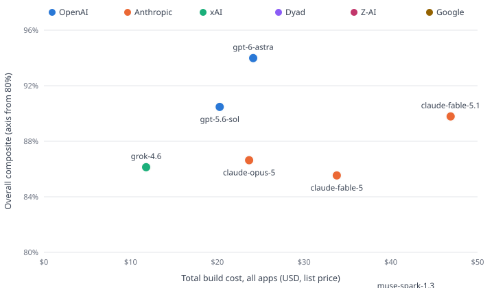

# App-Builder Benchmark — Results (Relay CRM column)

Run: 2026-07-29 · 7 models × 1 app (Relay CRM) × 3 milestones, N=1, Dyad
local-agent mode at product-default reasoning effort (medium, recorded per
request). Scored: 34 CUJs + 16 security probes per model (fixed Playwright
suites against pinned UI contracts) + LLM judge (gpt-5.6-sol, single judge,
input-capped). Costs are list-price dollars computed from exact per-request
token counts (cached/uncached/cache-write split) captured at the wire.

| Model           | Build  | Cost   | CUJs  | Security | Judge | Composite |
| --------------- | ------ | ------ | ----- | -------- | ----- | --------- |
| claude-fable-5  | 20 min | $12.86 | 32/34 | 16/16    | 0.78  | **93.1%** |
| gpt-5.6-sol     | 27 min | $8.70  | 31/34 | 16/16    | 0.81  | **91.8%** |
| claude-opus-5   | 22 min | $10.84 | 31/34 | 16/16    | 0.78  | **91.5%** |
| grok-4.5        | 19 min | $1.97  | 31/34 | 16/16    | 0.76  | **91.1%** |
| claude-sonnet-5 | 26 min | $8.26  | 31/34 | 16/16    | 0.75  | **91.0%** |
| gpt-5.6-luna    | 12 min | $1.46  | 32/34 | 15/16    | 0.72  | **90.8%** |
| gpt-5.6-terra   | 6 min  | $1.48  | 31/34 | 16/16    | 0.69  | **90.1%** |

<picture>
  <source media="(prefers-color-scheme: dark)" srcset="scatter-dark.svg">
  
</picture>

## Reading

- **Quality is a tight band (90–93%) while cost spans ~9×.** gpt-5.6-terra and
  gpt-5.6-luna deliver ≈97% of claude-fable-5's composite at ≈11% of its price.
- **terra built the app in 6 minutes** — 63 agent steps vs 120–260 for the
  others, same app size (~5k LOC) and equal CUJ pass rate: efficiency, not
  skipped work.
- **Every model passed all cross-tenant/role-escalation probes** except one
  luna miss (crm-m1-s02); server-side authorization held across the board.
- claude-sonnet-5 is the only model failing the sign-up-flow CUJ (crm-m1-01)
  at every checkpoint.

## Per-model failures

- **claude-fable-5**: crm-m1-05@ckpt2, crm-m1-01@ckpt3
- **gpt-5.6-sol**: crm-m1-05@ckpt1, crm-m1-05@ckpt2, crm-m1-08@ckpt3
- **claude-opus-5**: crm-m1-05@ckpt1, crm-m1-05@ckpt2, crm-m1-08@ckpt3
- **grok-4.5**: crm-m1-04@ckpt1, crm-m1-05@ckpt2, crm-m2-03@ckpt3
- **claude-sonnet-5**: crm-m1-01@ckpt1, crm-m1-01@ckpt2, crm-m1-01@ckpt3
- **gpt-5.6-luna**: crm-m1-s02@ckpt1, crm-m2-01@ckpt2, crm-m2-03@ckpt3
- **gpt-5.6-terra**: crm-m1-05@ckpt1, crm-m2-01@ckpt2, crm-m2-03@ckpt3

## Caveats (disclosed by design)

- N=1 per cell; single app so far (Relay CRM; apps 2–3 are designed, not run).
- Judge is gpt-5.6-sol for all candidates (user decision; same-vendor bias
  toward the gpt-5.6 family — mitigated by judge weight of 15%).
- claude-sonnet-5 priced at intro rates (through 2026-08-31).
- Durations exclude infra stalls (verified: zero client-abort rows in all
  seven cells); luna's cell predates the headless code-explorer fix but never
  attempted deep context.
- Web tools enabled (product realism over reproducibility; web drift caveat).

Regenerate: `node benchmarks/app-builder/report.mjs` (reads results/).
