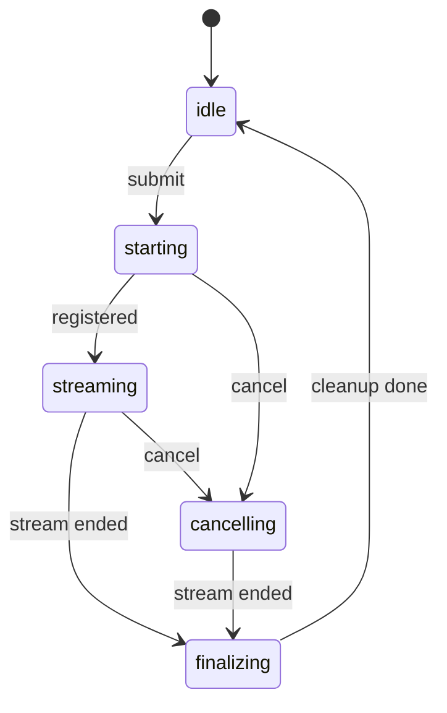
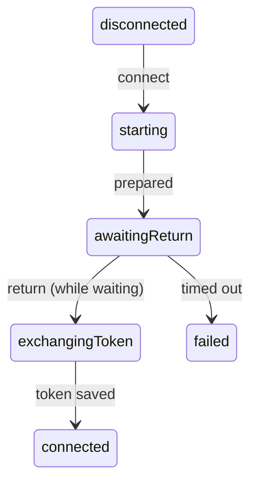

# Why Dyad uses state machines

For a long time, this comment sat in our chat streaming code:

```ts
// This prevents race conditions when clicking rapidly before state updates
const pendingStreamChatIds = new Set<number>();
```

That's a description of a bug, kept as a comment. And the workaround had its
own bug: if you hit Enter at the wrong moment, your message was silently
dropped after the input box had already cleared it. It looked sent. It never
went anywhere.

Here's how. Two pieces of code guarded the same door, using two copies of
the same fact. The input box read a React flag to decide "send now, or add
to the queue?" — and that flag updated one render behind reality. The send
function read this set, which updated instantly, and refused to start a
second stream for the same chat. Send a message, then hit Enter again in
the few milliseconds before the flag caught up: the input box said "not
streaming, send it now" and cleared your text, then the send function said
"already streaming, refuse" and returned without telling anyone. Not sent,
not queued, input already empty.

We kept fixing versions of this bug all over the app. Chat streaming, OAuth
sign-in, the plan-mode handoff, the version history preview. Different
features, same root cause. Starting in mid-2026 we rewrote these workflows as
small state machines, and this doc explains what that means, why we did it,
and shows real before/after code from the migration.

The conventions for writing one live in
[rules/state-machines.md](../rules/state-machines.md). This doc is the why.

## A quick primer, if state machines aren't familiar

A state machine is two lists and a rule:

- a list of named states the workflow can be in
- a list of events that can happen
- a rule that says, for every state and every event, what the next state is

Here's the chat streaming machine's happy path:



The important part is what this replaces. Without a machine, "where are we in
this workflow?" is answered by reading several booleans and hoping they
agree. With a machine there is one value, and it's always one of the named
states.

In Dyad, a machine is a plain TypeScript function. No library:

```ts
function transition(state: State, event: Event): { state: State; commands: Command[] }
```

It takes the current state and an event, and returns the next state plus a
list of commands. Commands are the side effects: "start the stream", "show a
toast", "wait 2.5 seconds". The function itself never does anything, it just
returns data. A small controller runs the commands and feeds the results back
in as new events. React components subscribe to the current state and render
it.

Because `transition` is a pure function, you can test the entire workflow as
a table: for each state, for each event, assert what comes out. No React, no
timers, no mocks.

## How the old code went wrong

None of the old code started out broken. It grew, one reasonable patch at a
time. The pattern went like this:

1. You add `isStreaming`. It works.
2. An async callback reads it after a delay and gets a stale value. So you
   add `isStreamingRef` and keep it in sync with an effect.
3. A response from an old request overwrites a new one. So you add a counter
   and check it before applying results.
4. Two things race on startup. So you add `setTimeout(..., 100)` to "let
   state settle".
5. A feature needs to react to streaming *ending*. There's no event for
   that, so you save the previous value and diff it against the current one
   every render.

Every step is a sensible fix for the bug in front of you. After a couple of
years you have five flags, three refs, and a timer, and they're only
correct when they all agree. The bugs live in the moments they don't.

The examples below are real code from this repository.

## Five flags for one question

Before the chat stream machine, "is this chat streaming?" had five separate
answers: the module-level set from the top of this doc, two Jotai atoms
(one of which existed only so the queue processor could watch it flip), a
counter used to trigger scrolling, and the main process's own bookkeeping.
Six different code paths set the main atom to `false`.

Three real bugs came out of this. Messages submitted in the wrong few
milliseconds were dropped. A cancel racing stream startup could leave the UI
saying "cancelled" while files kept changing on disk. And the message queue
could send the same message twice.

Now one machine per chat owns the answer. Here's what submitting looks like:

```ts
// src/chat_stream/transition.ts
case "idle": {
  switch (event.type) {
    case "submit": {
      const streamId = state.lastStreamId + 1;
      return {
        state: { type: "starting", streamId, request: event.request },
        commands: [{ type: "start-stream", streamId, request: event.request }],
      };
    }
  }
}
case "starting": {
  switch (event.type) {
    case "submit":
      // A stream is already starting: queue it, never drop it.
      return {
        state,
        commands: [{ type: "enqueue-message", request: event.request }],
      };
  }
}
```

"Starting" used to be a gap between two flag updates. Now it's a state, and
submitting during it has a defined answer: the message goes in the queue.
The dropped-message bug can't be written anymore, because there's no flag to
check too early.

## Guessing when a stream ends

Several features needed to know when a stream finished. There was no event
for it, so each one reconstructed the answer by saving last render's value
and comparing:

```ts
// src/hooks/useIntegrationContinuation.ts (before)
const prevStreamingRef = useRef<Map<number, boolean>>(new Map());

useEffect(() => {
  const prevStreaming = prevStreamingRef.current;
  const justStopped: number[] = [];
  for (const [chatId, wasStreaming] of prevStreaming) {
    const isStreaming = isStreamingById.get(chatId) ?? false;
    if (wasStreaming && !isStreaming) {
      justStopped.push(chatId);
    }
  }
  prevStreamingRef.current = new Map(isStreamingById);
  // ... do things with justStopped ...
});
```

This ran on every render, and only worked if React happened to render
between the `true` and the `false`. We had four copies of it.

The machine knows the exact moment a stream finishes, because finishing is
one of its transitions. So it emits an event, and the four copies became
four subscriptions:

```ts
// src/hooks/useIntegrationContinuation.ts (after)
useStreamFinished(({ chatId }) => {
  // runs once, exactly when this chat's stream finishes
});
```

## The 2.5 second sleep

Accepting a plan kicks off a chain: cancel the current stream, show a
confirmation, save the plan, start the implementation. It used to be one
long async function, with a sleep in the middle:

```ts
// src/hooks/usePlanEvents.ts (before)
await ipc.chat.cancelStream(payload.chatId);

setPlanState((prev) => { /* add chatId to transitioningChatIds */ });

// Pause so the user can see the "Plan accepted" confirmation
await new Promise((resolve) => setTimeout(resolve, 2500));

setPlanState((prev) => { /* remove chatId from transitioningChatIds */ });

// Read latest values from refs to avoid stale closure
const currentState = planStateRef.current;
```

Nothing stopped a second accept, an unmount, or the stream ending on its own
while this function was parked at an `await`. Whatever happened during those
2.5 seconds just interleaved with the middle of the chain.

Now each step of the chain is a state, and the pause is a command like any
other:

```ts
// src/plan_handoff/transition.ts (after)
case "cancelling-stream": {
  switch (event.type) {
    case "STREAM_CANCEL_FINISHED":
      return {
        state: { type: "transitioning", session: state.session },
        commands: [{ type: "wait", ms: TRANSITION_DISPLAY_MS }],
      };
    default:
      return ignoreEvent(state, event);
  }
}
```

A second accept arriving mid-chain now hits `ignoreEvent` and is recorded in
the debug log. Before, it interleaved silently. And the whole chain is
tested without a single real timer.

## Which sign-in attempt is this reply for?

Connecting Neon or Supabase opens the browser for OAuth, then waits for a
deep link back. The old code detected "a reply arrived" by watching a
timestamp change, and handled timeouts with a ref-managed timer:

```tsx
// src/components/NeonConnector.tsx (before)
useEffect(() => {
  if (lastDeepLink?.type === "neon-oauth-return") {
    if (oauthTimeoutRef.current) clearTimeout(oauthTimeoutRef.current);
    setIsOpeningOauth(false);
    // ... save settings, refetch, toast ...
  }
}, [lastDeepLink?.timestamp]);

const handleConnect = async () => {
  setIsOpeningOauth(true);
  await ipc.system.openExternalUrl("https://oauth.dyad.sh/.../neon/login");
  // Reset after 20s if the OAuth return never arrives
  oauthTimeoutRef.current = setTimeout(() => {
    setIsOpeningOauth(false);
    toast.warning(t("integrations.neon.signInTimedOut"));
  }, 20_000);
};
```

Real things users saw: double-clicking Connect left an orphaned timer that
later showed "timed out" out of nowhere. Finishing sign-in at second 25
showed "timed out" and then "connected". And a stale reply link would write
credentials with nothing checking which attempt it belonged to.

The fix has two parts. First, the machine allows one attempt per provider
at a time: clicking Connect while one is running does nothing, and a reply
only counts while an attempt is actually in `awaitingReturn`. For Neon and
Supabase that rule is the whole story, because their browser reply can't
carry anything back (the OAuth endpoint takes no client state to
round-trip) — so "the one attempt that's waiting" is the only match there
is, and it's always unambiguous.



Second, where a reply *can* carry an id back — GitHub's device flow polls
in a chain, and each poll knows which attempt started it — it must, and a
result from an old attempt is ignored:

```ts
// src/connection_flow/transition.ts (after)
if (state.flowId !== event.flowId) {
  return ignore(state, "flow-id-mismatch");
}
```

Either way, timeout and success can't both fire: they're two different
transitions out of the same waiting state, and only one can happen.

## What this buys us

- The bad states can't be constructed. "Timed out and connected" isn't a
  flag combination to guard against, it just doesn't exist. This is the
  "make impossible states impossible" idea, applied to async workflows.
- Every race gets decided up front. The transition function has to answer
  every state/event combination, and a test walks the whole table.
- Ignoring an event is explicit. `ignore(state, "flow-id-mismatch")` shows
  up in the debug log. A silent early return in an effect shows up nowhere.
- One thing writes the state. Components read a snapshot. When something
  looks wrong, there's one place to look.
- Tests are plain functions. No React, no fake timers, no flaky waits.

## Why not XState?

We considered it. Our machines turned out to need very different rules about
what runs at the same time and what gets dropped as stale: plan handoff
queues events and drains them in order, app run stamps everything with a
generation number, connection flow checks flow ids. A framework big enough
to express all of that would be bigger than the machines themselves, which
are each 100-200 lines. The shared code we did extract
(`src/state_machines/`) is only the parts that were literally identical:
the snapshot store, the React binding, the test helpers.

## When shouldn't I do this?

Don't wrap a machine around things that aren't multi-step workflows. A ref
holding an xterm or Monaco instance is fine. A "latest callback" ref is
fine. A plain TanStack Query fetch is fine. If there's no ordering problem
and no event that can arrive late, a machine adds ceremony and nothing else.

The warning signs that you do want one: you're adding a ref that mirrors
state so a callback can read it, a counter to reject stale responses, or a
`setTimeout` to "let state settle". That's the pattern from the top of this
doc, starting again.

## Where to look next

[rules/state-machines.md](../rules/state-machines.md) has the conventions:
file layout, invariants, and what tests are expected. For a complete example
to read, `src/plan_handoff/` is the smallest one. The shared plumbing is in
`src/state_machines/`.
